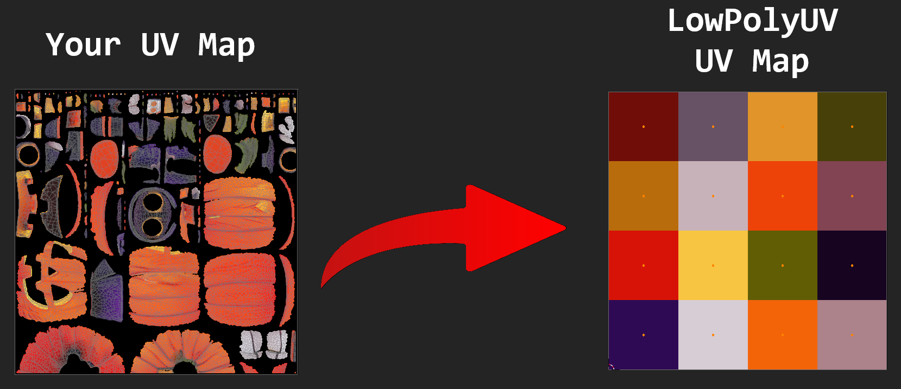
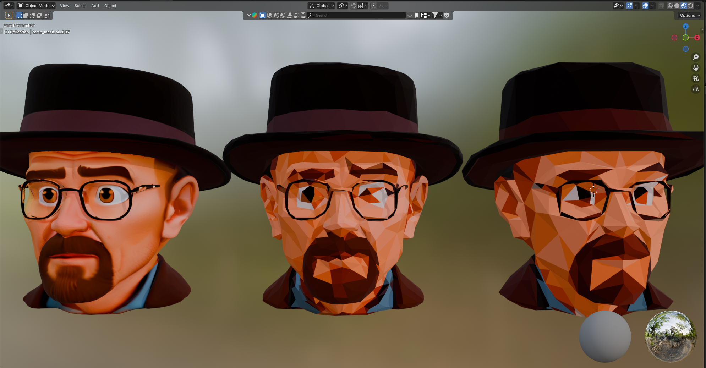
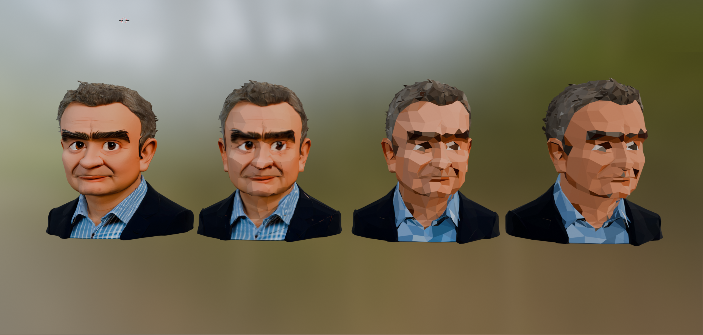
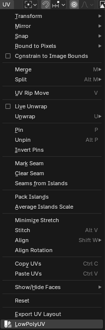

# LowPolyUV (Blender Addon)

A Blender addon that scales UV islands and snaps face colors to a clustered palette for low-poly UV workflows.

## Features

- **UV Island Scaling**: Scales selected UV islands toward their centers
- **Smart Palette Snapping**: Clusters face colors into a palette and snaps UVs to palette colors
- **Multi-Material Support**: Handles meshes with multiple materials
- **Texture Sampling**: Samples colors from texture images with optional downscaling
- **Material Color Fallback**: Falls back to material colors when textures are missing
- **Exclusive Material Color Mode**: Uses only material colors, ignoring textures entirely

## Screenshots

## Installation

1. Download the repository as a `.zip` file.
2. Open Blender.
3. Go to `Edit → Preferences → Add-ons → Install`.
4. Select the `.zip` file and click `Install Add-on`.
5. Enable the addon in the preferences.
6. Access it in the **UV Editor → UV → LowPolyUV**.

## Usage

1. Go to the **UV Editor** tab
2. Select a mesh object with UVs and an image texture.
3. Enter Edit Mode and select the faces you want to process.
3. In the **UV** menu, select **LowPolyUV**
4. Adjust the parameters in the popup dialog:
   - **UV Island Scale**: How much to scale each UV island toward its center (0.0 to 1.0)
   - **Max Colors**: Maximum number of colors in the palette (1-256)
   - **Block Size**: Size of each color block in pixels (1-64)
   - **Use Downscaled Image**: Use a scaled-down copy of textures for faster sampling
   - **Downscale Max Size**: Maximum resolution for downscaled images (64-4096)
   - **Fallback to Material Color**: Use material color when no texture is found
   - **Only Use Material Color**: Use only material colors, ignore textures

## Parameters Explained

### UV Island Scale
Controls how much UV islands are scaled toward their centers. Values closer to 0.0 shrink more, while values closer to 1.0 shrink less.

### Max Colors
Determines the maximum number of colors in the resulting palette. The algorithm uses K-means clustering to reduce the color count while preserving important color variations.

### Block Size
Sets the pixel size of each color block in the generated palette texture.

### Fallback to Material Color
When enabled, this will use material colors when textures are missing or when texture sampling fails.

### Only Use Material Color
When enabled, this will ignore all textures and use only the material colors for color clustering and palette generation.

## Technical Details

### Color Clustering
The addon uses a custom K-means implementation that:
- Preserves rare light colors
- Reduces redundant dark clusters
- Balances color distribution across the palette

### Texture Sampling
- Samples the center UV coordinate of each face
- Uses a 3x3 pixel average for fallback when sampling fails
- Supports texture downscaling for performance optimization

### Multi-Material Handling
- Respects different materials on the same mesh
- Caches texture sampling per material to avoid redundant operations
- Supports multiple texture types and node setups

## Pixel Art Workflow

This tool can also create pixel-art versions of existing images using the following workflow:

1. **Add a Plane** - Create a basic plane mesh
2. **Add Texture to Plane Material** - Apply your source image as a texture
3. **Add Multiresolution Modifier** - Add the multiresolution modifier to the plane
4. **Click "Simple" 5-6 times** - Increase the mesh resolution through multiresolution
5. **Apply the Modifier** - Apply the multiresolution modifier to finalize the topology
6. **Go to Edit Mode and check if topology suits your needs** - Verify the mesh topology
7. **If it's too less yet: start over with step 3** - Repeat if needed for more detail
8. **Run LowpolyUV** - Execute the addon to create your pixel art low-poly version

## Requirements

- Blender 3.0 or higher
- Python 3.7 or higher
- Tested with Blender 4.5

## License

This addon is licensed under the **GNU General Public License v3.0 (GPL-3.0)**.  
You are free to use, modify, and distribute it, **but any derivative work must also be GPL-3.0**.  
See the [LICENSE](LICENSE) file for full details.

## Author

Rainer Wahnsinn

## Contributing

Fork the repo, make your changes, and submit a pull request.  
Please keep modifications under GPL-3.0 and credit the original author, me Rainer.